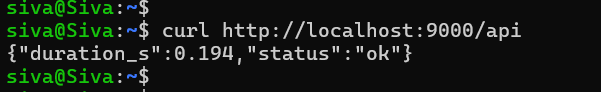
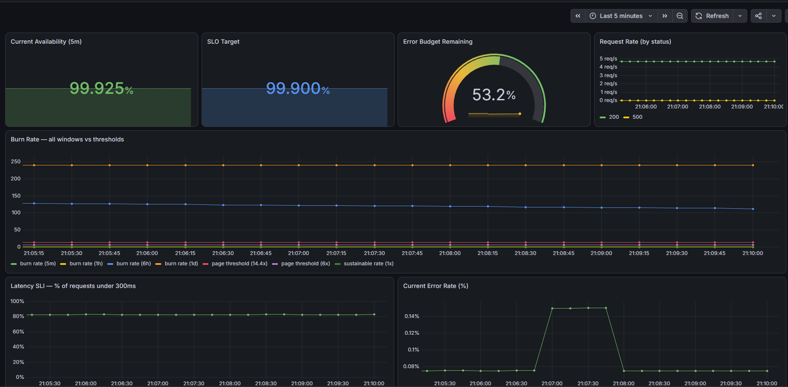
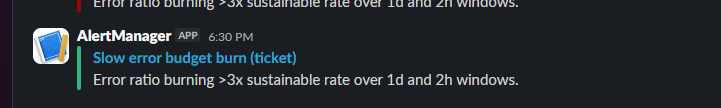
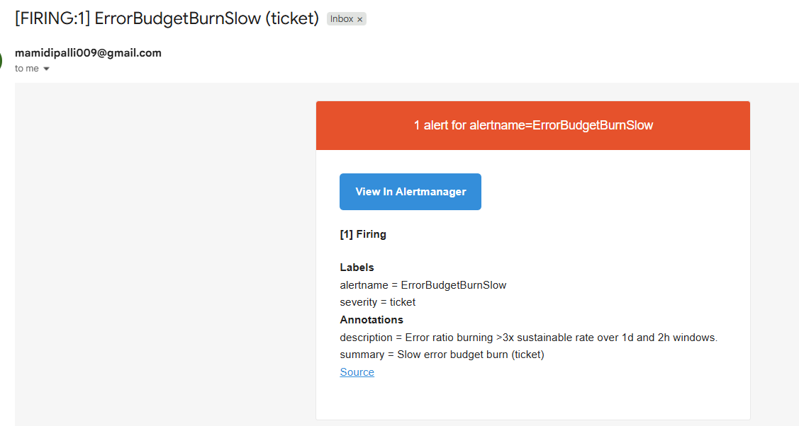

# app-observability-stack

A sample Flask app instrumented with Prometheus metrics, monitored against an
availability SLO using multi-window, multi-burn-rate alerting: the pattern
described in the Google SRE Workbook, not a simplified "error rate > X%" alert.

> **Reliability summary:** defines a 99.9% availability SLO, tracks the error
> budget in real time, and pages only when the burn rate genuinely threatens
> the budget. Fast, severe burns page within 2 minutes; slow burns file a
> ticket instead of waking anyone up.

## Overview

Most "monitoring" projects alert on a flat threshold: error rate above some
percentage, page immediately. That approach either pages too often (noisy,
ignored) or too late (the SLO is already blown by the time it fires). This
project implements the alternative: **error budgets and burn rate**.

**What I configured:**
- A Flask app exposing Prometheus metrics (`http_requests_total` by status
  code, `http_request_duration_seconds` as a histogram) and a `/chaos`
  endpoint to adjust its error rate at runtime, for controlled testing.
- Prometheus recording rules computing the error-ratio SLI across 7 time
  windows (5m through 3d).
- 4 burn-rate alert rules, each requiring both a long window and a short
  window to agree before firing. This is what prevents a single short blip
  from paging anyone, while still catching genuine fast degradations quickly.
- A Grafana dashboard showing current availability against the 99.9% target,
  error budget remaining, and burn rate across all windows on one graph.
- The app and its load generator run via `docker-compose`. Prometheus,
  Alertmanager, and Grafana are not part of this docker-compose stack.
  They already run as standalone applications on a WSL Ubuntu server,
  configured separately in a companion project. This project simply adds a
  new scrape target and new alert rules to that existing install rather
  than starting a second, duplicate monitoring stack.

**What this document is trying to show:** the SRE concept of error budgets in
a way you can actually run, break, and watch recover, not just describe. The
Testing section walks through deliberately spiking the error rate via the
`/chaos` endpoint and watching the burn-rate alert fire, then resolving it and
watching the alert clear.

## Table of Contents

- [Overview](#overview)
- [What is an SLI / SLO / Error Budget / Burn Rate](#what-is-an-sli--slo--error-budget--burn-rate)
- [Folder Structure](#folder-structure)
- [Architecture](#architecture)
- [Alert Rules](#alert-rules)
- [Setup](#setup)
- [Screenshots](#screenshots)
- [Testing](#testing)
- [Troubleshooting / FAQ](#troubleshooting--faq)
- [Runbook: ErrorBudgetBurnFast](#runbook-errorbudgetburnfast)
- [Production Considerations](#production-considerations)
- [Status / Roadmap](#status--roadmap)
- [License](#license)

## What is an SLI / SLO / Error Budget / Burn Rate

- **SLI** (Service Level *Indicator*): the actual measurement. What really
  happened. Here: the fraction of requests that succeeded, measured right now.
- **SLO** (Service Level *Objective*): the internal target you hold yourself
  to. Here: **99.9% of requests should succeed.** This is a goal your own
  team sets. No external party is necessarily aware of it.
- **SLA** (Service Level *Agreement*): a contractual promise to an external
  customer, usually with a penalty attached if missed (refunds, credits).
  Not implemented in this demo project. SLAs are a business/legal layer on
  top of an SLO, and this repo only needs the SLI/SLO layer to demonstrate
  the alerting pattern. An SLA is typically set *looser* than the internal
  SLO, to leave a safety margin.
- **Error budget**: the allowed failure margin implied by the SLO. At 99.9%,
  you're allowed 0.1% of requests to fail. Think of it like an allowance:
  you're permitted a small number of failures before you've broken your
  promise, and "error budget remaining" just asks *how much of that small
  allowance is still unused*, not "what % of requests are failing."
  Concretely: if the SLO allows 10 failures per 10,000 requests, and you've
  had 5, you're at 50% budget remaining. If you've had 15, you're at -50%.
  You've gone past what you were allowed.
- **Burn rate**: how fast the error budget is being consumed, relative to a
  sustainable pace. A burn rate of 1 means you're failing at exactly the rate
  the budget allows: sustainable, not urgent. A burn rate of 14.4 means
  you'd exhaust the entire budget in about 2 days if it continued: an
  emergency, worth paging someone immediately.

This project alerts on burn rate, not on a flat error-rate threshold, which is
why the alert rules require **both** a short window and a long window to
agree. A single 5-minute blip doesn't page anyone unless it's also part of a
sustained pattern.

## Folder Structure

```
app-observability-stack/
├── README.md
├── LICENSE
├── .gitignore
├── docker-compose.yml          # runs app + db + loadgen
│
├── app/
│   ├── app.py                  # the Flask app: /api, /metrics, /chaos/*, /healthz
│   ├── requirements.txt        # Python dependencies (Flask, prometheus-client)
│   ├── Dockerfile              # builds the app container
│   ├── loadgen.sh              # continuously calls /api to generate traffic
│   └── Dockerfile.loadgen      # builds the load-generator container
│
├── prometheus/
│   ├── prometheus.yml          # scrape config (for a standalone Prometheus)
│   ├── recording.rules.yml     # pre-computed SLI error ratios, 5m through 3d
│   └── alerting.rules.yml      # the 4 burn-rate alerts + AppDown
│
├── alertmanager/
│   └── alertmanager.yml.example  # Slack routing template (copy -> alertmanager.yml, add real webhook)
│
├── grafana/
│   ├── dashboards/
│   │   └── slo-dashboard.json  # dashboard export (see Setup; built manually in practice)
│   └── provisioning/
│       ├── datasources/datasource.yml   # auto-registers Prometheus as a data source
│       └── dashboards/dashboard.yml     # auto-loads dashboards from the folder above
│
└── docs/
    └── screenshots/             # dashboard.png, burn-rate-alert.png, slack-alert.png
```

**Summary of responsibilities by directory:**

| Path | Responsibility |
|---|---|
| `app/` | The instrumented service under observation. Exposes a simulated workload endpoint that succeeds under normal conditions, fails at a small, configurable baseline rate, and accepts runtime fault injection via its `/chaos` endpoints for controlled testing. |
| `prometheus/` | Defines the evaluation logic: what constitutes a healthy state, and the recording and alerting rules used to continuously assess the service against that definition. |
| `alertmanager/` | Receives firing alerts from Prometheus and handles routing and delivery to notification channels (Slack, in this repository). |
| `grafana/` | Provides the visualization layer, rendering the metrics collected by Prometheus into human-readable dashboards. |
| `docker-compose.yml` | Defines and orchestrates the application, its database, and its load generator as a single reproducible deployment. |

## Architecture

```
loadgen (traffic) -> app (Flask + /metrics) -> Prometheus (recording +
burn-rate rules) -> Alertmanager (routes to Slack)
                                     |
                                     v
                                  Grafana (SLO dashboard)
```

| Component | Role | Where it runs |
|---|---|---|
| `app` | Flask app exposing `/api` (simulated workload), `/metrics` (Prometheus format), `/chaos/*` (fault injection) | Docker container |
| `loadgen` | Continuously hits `/api` so there's always traffic for the SLI to measure | Docker container |
| `db` | Postgres, for future DB-call instrumentation (see Status / Roadmap) | Docker container |
| Prometheus | Scrapes `app`, evaluates recording + alerting rules | Standalone application, already installed and preconfigured |
| Alertmanager | Routes firing alerts to Slack | Standalone application, already installed and preconfigured |
| Grafana | SLO dashboard | Standalone application, already installed and preconfigured |

## Alert Rules

| Alert | Long window | Short window | Burn rate | `for` | Severity |
|---|---|---|---|---|---|
| `ErrorBudgetBurnFast` | 1h | 5m | 14.4x | 2m | page |
| `ErrorBudgetBurnModerate` | 6h | 30m | 6x | 15m | page |
| `ErrorBudgetBurnSlow` | 1d | 2h | 3x | 1h | ticket |
| `ErrorBudgetBurnVerySlow` | 3d | 6h | 1x | 3h | ticket |
| `AppDown` | n/a | n/a | n/a | 2m | page |

Each burn-rate alert requires **both** windows to exceed the threshold
simultaneously. This is the "multi-window" part of the pattern, and it's
what keeps a single noisy 5-minute spike from paging anyone unless the
longer window confirms it's a real, sustained problem.

## Setup

### Prerequisites
- Docker and Docker Compose
- Prometheus, Alertmanager, and Grafana, already installed and preconfigured
  as standalone applications (this repository assumes an existing install,
  such as the one from a companion host-monitoring project, rather than
  provisioning these from scratch)
- (Optional) A Slack workspace with an Incoming Webhook, to receive alert notifications

### 1. Start the app, load generator, and database

```bash
git clone https://github.com/smamidipalli009/app-observability-stack.git
cd app-observability-stack
docker compose up -d --build
curl http://localhost:9000/api   # sanity check, should return JSON
```



The app listens on host port **9000** (mapped from its internal port 5000).

### 2. Point Prometheus at it

This repository assumes Prometheus is already installed and preconfigured as
a standalone application (for example, from a companion host-monitoring
project). No new Prometheus instance is required; this app is simply added
as an additional scrape target and rule set to the existing installation.

Copy `prometheus/recording.rules.yml` and `prometheus/alerting.rules.yml` to
wherever the existing Prometheus configuration lives, then add to
`prometheus.yml`:

```yaml
rule_files:
  - "recording.rules.yml"
  - "alerting.rules.yml"
  # ...plus any existing rule files you already have

scrape_configs:
  - job_name: "app"
    static_configs:
      - targets:
          - "localhost:9000"
  # ...plus any existing scrape jobs you already have
```

```bash
promtool check config /path/to/prometheus.yml
sudo systemctl restart prometheus
```

Confirm at `http://localhost:9090/targets` that the `app` job shows **UP**,
and at `http://localhost:9090/alerts` that the 5 new rules are listed.

### 3. Alertmanager

Alertmanager is likewise assumed to already be installed and preconfigured
as a standalone application. Merge the routing from
`alertmanager/alertmanager.yml.example` into the existing configuration (or
add a new route matching `severity: page` / `severity: ticket` to the
existing Slack receiver).

If a fresh Alertmanager install is needed instead:

```bash
cp alertmanager/alertmanager.yml.example alertmanager/alertmanager.yml
# edit in your real Slack webhook URL
```

### 4. Grafana, build the dashboard

`grafana/dashboards/slo-dashboard.json` contains a working export pulled
directly from a live instance, with each panel correctly bound to its
Prometheus datasource by UID. Importing this file may still require
re-selecting the datasource in the import dialog, since datasource UIDs are
specific to each Grafana installation (see Troubleshooting for the
binding issue this repository ran into earlier). If import does not bind
correctly, the 7 panels can be built directly with the queries below,
which is the approach that was used in practice:

| Panel | Type | Query |
|---|---|---|
| Current Availability (5m) | Stat | `1 - slo:requests:error_ratio_rate5m` |
| SLO Target | Stat | `vector(0.999)` |
| Error Budget Remaining | Gauge | `(1 - (slo:requests:error_ratio_rate1h / 0.001)) * 100` |
| Request Rate (by status) | Time series | `sum by (status) (rate(http_requests_total[5m]))` |
| Burn Rate (all windows) | Time series | `slo:requests:error_ratio_rate5m / 0.001`, `...rate1h / 0.001`, `...rate6h / 0.001`, `...rate1d / 0.001`, plus flat lines `14.4`, `6`, `1` for reference thresholds |
| Latency SLI | Time series | `slo:requests:latency_good_ratio_rate5m` |
| Current Error Rate (%) | Time series | `slo:requests:error_ratio_rate5m` (unit: Percent 0.0-1.0, not 0-100, see troubleshooting note below) |

Note: the Error Budget Remaining panel uses the 1h error-ratio recording rule
rather than the `slo:error_budget:remaining_percent` rule defined in
`recording.rules.yml` (which is based on a 3d window). On an app that has
only been running a short while, a 3-day window does not yet contain enough
history to produce a meaningful reading; see the Troubleshooting section for
details. The 1h-based query is what was actually used to produce the
screenshots in this repository, and is the version saved in
`grafana/dashboards/slo-dashboard.json`.

## Screenshots

**Dashboard, healthy baseline state:**



Current availability (99.925%) above the 99.9% target, error budget remaining
at a healthy 53.2%, burn rate flat across all windows, and current error rate
holding near baseline.

**Alert notifications, captured during the chaos test documented in
[Testing](#testing):**

| Slack | Email |
|---|---|
|  |  |

Both show `ErrorBudgetBurnSlow` (ticket severity) firing, with the annotation
describing the condition that triggered it: error ratio burning at more than
3x the sustainable rate over both the 1d and 2h windows.

## Testing

The `/chaos/error_rate/<float>` endpoint lets you spike the app's error rate
on demand, without redeploying anything, so the burn-rate alert can be
triggered and observed firing and resolving. **This was actually run against
the live stack; the results below are the real output, not hypothetical.**

**1. Confirm baseline (quiet) state:**

```bash
curl http://localhost:9000/chaos/status
# {"error_rate": 0.0005, "latency_min": 0.05, "latency_max": 0.35}

curl -s http://localhost:9090/api/v1/alerts | python3 -m json.tool
# {"status":"success","data":{"alerts":[]}}
```

**2. Spike the error rate to well above the sustainable rate:**

```bash
curl -X POST http://localhost:9000/chaos/error_rate/0.5
# 50% of requests will now fail
```

**3. Watch the burn rate climb** on the Grafana dashboard's "Burn Rate" panel.
In the actual test run, the error rate settled around ~48-50% sustained
(random jitter around the configured 0.5), driving the burn rate to roughly
**480-500x** the sustainable rate, dramatically past even the 14.4x page
threshold, and Current Availability dropped to ~53%.

**4. After a few minutes of sustained spike, check alert state:**

```bash
curl -s http://localhost:9090/api/v1/alerts | python3 -m json.tool
```

**Actual result:** `ErrorBudgetBurnFast` and `ErrorBudgetBurnModerate` both
reached `"state": "firing"` (page severity). `ErrorBudgetBurnSlow` and
`ErrorBudgetBurnVerySlow` were still `"state": "pending"` at the same moment.
This is expected: their `for:` durations (1h and 3h respectively) are much
longer, so on a short test run they simply hadn't finished counting down yet.
It's not a sign anything was wrong. See Prometheus screenshot: FIRING (2),
PENDING (2), INACTIVE (1, `AppDown`: the app itself stayed up, only its
error rate was affected).

Confirmed delivered to Slack as well.

**5. Revert the error rate:**

```bash
curl -X POST http://localhost:9000/chaos/error_rate/0.0005
```

**Important: alerts do not clear instantly.** Each recording rule is a
rolling average over its window (5m, 1h, 6h, etc.), so the recent spike data
has to actually age out of that window before the calculated rate drops back
under threshold. In practice:
- `ErrorBudgetBurnFast` (5m/1h windows) cleared within roughly 5-10 minutes
  of reverting
- `ErrorBudgetBurnModerate` (30m/6h windows) took noticeably longer
- `ErrorBudgetBurnSlow`/`VerySlow` (2h/1d, 6h/3d windows) took the longest,
  since their windows are largest, and on an app that's only been running
  a short while, the spike still represents a large share of all the data
  those windows have ever seen

**Takeaway worth documenting:** recovery time scales directly with window
length. This is a real, observed property of the multi-window burn-rate
pattern, not a Grafana or Prometheus quirk. The same behavior would occur
in production, just proportionally (a spike on a service with 30 days of
history dilutes out of a 3-day window much faster in relative terms than it
does here, where the service barely has 3 days of history to begin with).

## Troubleshooting / FAQ

**Q: I spiked the error rate, but the alerts that fired first were
`ErrorBudgetBurnSlow`/`ErrorBudgetBurnVerySlow` (the 1d/3d ones), not
`ErrorBudgetBurnFast` (the 5m/1h one). Isn't that backwards?**

Yes, and here's why it happens on a freshly-started Prometheus. The long-window
alerts use `rate(...[1d])` / `rate(...[3d])`. If the app has only been running
for an hour or two, nowhere near a real day or 3 days, Prometheus still
computes that rate using whatever data actually exists. A single large spike
then makes up a much bigger share of that small dataset than it would in a
mature, long-running system, so the "long window" number gets dragged toward
the spike almost as much as the short window does. It sometimes crosses
threshold first, purely because there isn't enough real history yet to dilute
it. This is a **data-maturity artifact, not a bug** in the alert logic. It
goes away naturally once the app has been running continuously for several
days. If you want the demo to behave "as expected" (`Fast` firing before
`Slow`), let the app run for a while before doing the chaos test, or
temporarily shorten the long-window rules for demonstration purposes.

**Q: My chaos spike didn't trigger anything at all.**

Check how long the spike actually lasted. Each alert has a `for:` duration.
`ErrorBudgetBurnFast` needs the burn rate to stay above threshold
continuously for a full 2 minutes before it flips from `pending` to `firing`.
If you reverted the error rate before that timer completed, Prometheus resets
back to `inactive`. This is the alert correctly ignoring a brief blip, not a
failure to detect it. Re-run the spike and leave it untouched for at least
3-4 minutes.

**Q: The imported Grafana dashboard JSON shows blank/no-data panels, or the
query box looks empty.**

In practice, importing the dashboard JSON directly had datasource-binding
issues: panels either didn't bind to the right datasource UID, or in one
case a query's `expr` field ended up empty after import. Building the 7
panels manually (see the query table in Setup) avoided this entirely and is
the more reliable path.

**Q: `Error Budget Remaining` shows a large negative percentage even though
the app looks fine.**

Check the app's baseline `error_rate`. A 99.9% SLO only allows a 0.1% error
rate. If the app's default is set higher than that (this repo originally
defaulted to 0.5%, five times over budget), the gauge will correctly show a
large negative number even under "normal" operation, because normal
operation is already violating the SLO. Lower `ERROR_RATE` in `app.py` (or
via the environment variable) to something under 0.1% for a healthy baseline.

## Runbook: ErrorBudgetBurnFast

**Fires when:** error ratio exceeds 14.4x the sustainable rate over both a 1h
and a 5m window. This alert means the error budget would be fully consumed
in about 2 days if the current rate continues.

1. Open the Grafana dashboard → Current Error Rate and Request Rate by
   status panels to see the scale of the problem (all traffic failing, or a
   subset?).
2. Check for a recent deploy or config change correlated with the spike.
3. If caused by a bad deploy, roll back immediately. This is a page-severity
   alert specifically because the budget burns fast enough that waiting for
   a fix-forward is likely to blow the SLO.
4. Once mitigated, confirm the rate has dropped and watch the alert clear on
   its own. Don't silence it manually unless the underlying cause will take
   longer to fully resolve than the alert's `for` window.

## Production Considerations

- Prometheus's default retention is shorter than a true 30-day SLO window
  needs. In production, use `remote_write` to Thanos or Mimir for long-term
  storage so the 3d/1d recording rules used here could genuinely extend to a
  full 30-day rolling window.
- The `/chaos` endpoints exist purely for demonstrating and testing the
  alerting pipeline. A production service would not ship fault-injection
  endpoints on its public API; they'd live behind an internal-only route or
  a separate chaos-engineering tool (e.g. Chaos Mesh, Gremlin).
- A single Alertmanager instance is a single point of failure for the whole
  notification path; run it as an HA cluster in production.
- This dashboard tracks one SLI (availability) and one (latency) informally.
  A production SLO would formally define and alert on both, and likely
  additional SLIs (e.g. p99 latency, throughput) depending on what the
  service actually promises to its consumers.

## Status / Roadmap

- [x] Flask app with Prometheus metrics + `/chaos` fault injection
- [x] 7 SLI recording rules across time windows
- [x] 4 multi-window burn-rate alert rules + `AppDown`
- [x] Grafana dashboard (built manually via direct PromQL; the JSON-import
      path had datasource-binding issues in practice and wasn't reliable)
- [x] Baseline error rate tuned so the app sits within its own SLO by default
      (0.05%, under the 0.1% budget), so the chaos test demonstrates a real
      budget burn rather than starting already over budget
- [ ] Postgres container is present in `docker-compose.yml` but the app does
      not yet query it. DB-call instrumentation (`db_query_duration_seconds`,
      `db_errors_total`, a `/chaos/db_latency` endpoint, and matching
      dashboard panels) is intentionally deferred; see the comment in
      `docker-compose.yml` and the note above
- [x] Full Testing section walkthrough, run live against the actual stack:
      `ErrorBudgetBurnFast` and `ErrorBudgetBurnModerate` confirmed firing
      and delivered to Slack, `ErrorBudgetBurnSlow`/`VerySlow` confirmed
      correctly still pending at the same moment (longer `for:` windows),
      and alert-clearing behavior confirmed and documented in Troubleshooting

## License

MIT. See LICENSE file.

---

**Security note:** `alertmanager.yml` (real Slack webhook) is gitignored.
Only `alertmanager.yml.example`, with placeholder values, is committed.
